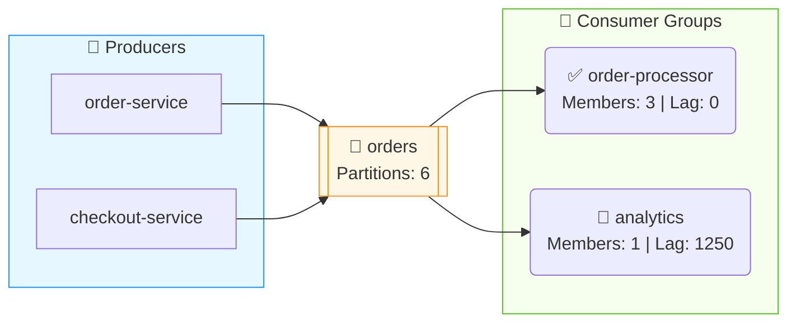

# Kafka Management System - UI Design Document

> **Last Updated**: 2026-05-18  
> **Tech Stack**: React 19 + TypeScript + Ant Design 5.x + Vite  
> **Design Philosophy**: Clean, Professional, Data-Driven

---

## 📐 Design Principles

### 1. Khoa Học (Scientific)
- Hiển thị dữ liệu chính xác, real-time
- Sử dụng biểu đồ và visualization để trực quan hóa
- Mermaid diagrams cho message flow

### 2. Tiện Lợi (Convenient)
- Navigation đơn giản, dễ tìm
- Quick actions ngay trên table rows
- Search và filter mọi nơi
- Keyboard shortcuts support

### 3. Chuyên Nghiệp (Professional)
- Color scheme nhất quán
- Typography rõ ràng
- Responsive design
- Loading states và error handling

---

## 🎨 Color Palette

### Primary Colors
| Color | Hex | Usage |
|-------|-----|-------|
| Primary Blue | `#1890ff` | Primary actions, links, highlights |
| Success Green | `#52c41a` | Success states, healthy status |
| Warning Orange | `#faad14` | Warnings, lag alerts |
| Error Red | `#ff4d4f` | Errors, critical alerts |
| Purple | `#722ed1` | Messages, statistics |

### Neutral Colors
| Color | Hex | Usage |
|-------|-----|-------|
| Text Primary | `rgba(0,0,0,0.85)` | Main text |
| Text Secondary | `rgba(0,0,0,0.45)` | Secondary text, descriptions |
| Border | `#d9d9d9` | Borders, dividers |
| Background | `#f5f5f5` | Page background |
| Card Background | `#ffffff` | Cards, content areas |

### Status Colors
| Status | Color | Icon |
|--------|-------|------|
| Connected | Green `#52c41a` | ✅ CheckCircle |
| Disconnected | Red `#ff4d4f` | ❌ Disconnect |
| Stable | Green | Badge success |
| Empty | Gray | Badge default |
| Rebalancing | Blue | Badge processing |
| Warning | Orange | ⚠️ Warning |

---

## 📱 Layout Structure

### Overall Layout
```
┌─────────────────────────────────────────────────────────────┐
│                         HEADER                               │
│  [☰] [Cluster Selector ▼]                    [👤 Admin ▼]   │
├──────────┬──────────────────────────────────────────────────┤
│          │                                                   │
│  SIDEBAR │                    CONTENT                        │
│          │                                                   │
│ Dashboard│   ┌─────────────────────────────────────────┐    │
│ Topics   │   │  Page Title              [Actions]      │    │
│ Consumer │   ├─────────────────────────────────────────┤    │
│ Groups   │   │                                         │    │
│ Schemas  │   │              Main Content               │    │
│ Connect  │   │                                         │    │
│ ACLs     │   │                                         │    │
│ ──────── │   │                                         │    │
│ Admin    │   │                                         │    │
│  Users   │   │                                         │    │
│  Roles   │   │                                         │    │
│  Clusters│   └─────────────────────────────────────────┘    │
│          │                                                   │
└──────────┴──────────────────────────────────────────────────┘
```

### Dimensions
| Element | Size | Notes |
|---------|------|-------|
| Sidebar Width | 240px | Collapsible to 80px |
| Header Height | 64px | Fixed |
| Content Padding | 24px | All sides |
| Card Border Radius | 8px | Ant Design default |

---

## 🧩 Component Patterns

### 1. Page Header Pattern
```tsx
<div style={{ display: 'flex', justifyContent: 'space-between', marginBottom: 16 }}>
  <Title level={4} style={{ margin: 0 }}>Page Title</Title>
  <Space>
    <Input placeholder="Search..." prefix={<SearchOutlined />} />
    <Button icon={<ReloadOutlined />}>Refresh</Button>
    <Button type="primary" icon={<PlusOutlined />}>Create</Button>
  </Space>
</div>
```

### 2. Disconnected Alert Pattern
```tsx
{!isConnected && (
  <Alert
    message="Cluster Disconnected - Showing Sample Data"
    description="Connect to Kafka broker to see real data."
    type="warning"
    showIcon
    icon={<DisconnectOutlined />}
    style={{ marginBottom: 16 }}
  />
)}
```

### 3. Statistics Card Pattern
```tsx
<Card hoverable>
  <Statistic
    title="Topics"
    value={24}
    prefix={<DatabaseOutlined style={{ color: '#1890ff' }} />}
  />
</Card>
```

### 4. Data Table Pattern
```tsx
<Table
  columns={columns}
  dataSource={data}
  rowKey="id"
  loading={isLoading}
  pagination={{
    showSizeChanger: true,
    showQuickJumper: true,
    showTotal: (total) => `Total ${total} items`,
  }}
/>
```

### 5. Status Badge Pattern
```tsx
// Connection Status
<Badge status={isConnected ? 'success' : 'error'} />

// Consumer Group State
const stateColor = state === 'STABLE' ? 'success' : 
                   state === 'EMPTY' ? 'default' : 'processing';
<Badge status={stateColor} text={state} />
```

### 6. Action Buttons Pattern
```tsx
<Space>
  <Tooltip title="View Details">
    <Button type="text" icon={<EyeOutlined />} />
  </Tooltip>
  <Tooltip title="Edit">
    <Button type="text" icon={<EditOutlined />} />
  </Tooltip>
  <Tooltip title="Delete">
    <Button type="text" danger icon={<DeleteOutlined />} />
  </Tooltip>
</Space>
```

---

## 📄 Page Designs

### 1. Dashboard
**Purpose**: Overview của cluster health và key metrics

**Components**:
- 4 Statistics Cards (Topics, Consumer Groups, Messages, Brokers)
- Top Topics by Messages (List)
- Consumer Group Lag (List with Progress bars)
- Cluster Health (Under-replicated, Offline partitions, Controllers)

**Layout**:
```
┌─────────────────────────────────────────────────────────────┐
│ Dashboard - Cluster Name                                     │
├─────────────────────────────────────────────────────────────┤
│ ⚠️ Cluster Disconnected Alert (if applicable)               │
├──────────┬──────────┬──────────┬──────────────────────────────┤
│ 📊 Topics│ 👥 Groups│ 💬 Msgs  │ 🖥️ Brokers                  │
│    24    │    12    │   1.2M   │    3 [Healthy]              │
├──────────┴──────────┴──────────┴──────────────────────────────┤
│ Top Topics by Messages      │ Consumer Group Lag             │
│ ┌─────────────────────────┐ │ ┌─────────────────────────────┐│
│ │ orders      125,000 msgs│ │ │ order-processor   1,250 lag ││
│ │ payments     89,000 msgs│ │ │ payment-handler       0 lag ││
│ │ notifications 45,000    │ │ │ notification-sender  45 lag ││
│ └─────────────────────────┘ │ └─────────────────────────────┘│
├─────────────────────────────────────────────────────────────┤
│ Cluster Health                                               │
│ Under Replicated: 0  │  Offline: 0  │  Controllers: 1       │
└─────────────────────────────────────────────────────────────┘
```

### 2. Topics List
**Purpose**: Quản lý và browse topics

**Features**:
- Search by topic name
- Sort by name, partitions, messages
- Show consumer groups per topic
- Quick actions: View, Create

**Table Columns**:
| Column | Width | Features |
|--------|-------|----------|
| Topic Name | auto | Icon, Link, Internal tag |
| Partitions | 120px | Sortable |
| Replication Factor | 160px | - |
| Messages | 120px | Sortable, formatted |
| Consumer Groups | 280px | Tags with status, lag |
| Actions | 80px | View button |

### 3. Topic Detail
**Purpose**: Chi tiết topic với tabs

**Tabs**:
1. **Overview**: Basic info + Partitions table
2. **Message Flow**: Mermaid diagram + Consumer groups table
3. **Messages**: Browse, produce, filter messages
4. **Configuration**: Topic configs with edit

**Message Flow Diagram**:
```
┌─────────────────────────────────────────────────────────────┐
│ 🚀 Producers          📨 Topic              👥 Consumers    │
│ ┌─────────────┐      ┌─────────────┐      ┌─────────────┐  │
│ │order-service│ ───▶ │   orders    │ ───▶ │order-proc   │  │
│ │checkout-svc │ ───▶ │ Partitions:6│ ───▶ │analytics    │  │
│ └─────────────┘      └─────────────┘      └─────────────┘  │
└─────────────────────────────────────────────────────────────┘
```

### 4. Consumer Groups
**Purpose**: Quản lý consumer groups

**Table Columns**:
| Column | Features |
|--------|----------|
| Group ID | Link to detail |
| State | Badge (STABLE/EMPTY/REBALANCING) |
| Members | Count |
| Topics | Tags |
| Total Lag | Color-coded (green/orange/red) |
| Actions | View, Delete |

### 5. Consumer Group Detail
**Purpose**: Chi tiết consumer group

**Sections**:
- Basic Info (State, Coordinator, Assignor)
- Members Table (ID, Client, Host, Assignments)
- Offsets Table (Topic, Partition, Current, End, Lag)
- Reset Offsets Modal

### 6. Schema Registry
**Purpose**: Quản lý Avro/JSON/Protobuf schemas

**Features**:
- List subjects with type tags
- View schema content (formatted JSON)
- Version history
- Compatibility settings

### 7. Kafka Connect
**Purpose**: Quản lý connectors

**Table Columns**:
| Column | Features |
|--------|----------|
| Name | Link |
| Type | SOURCE/SINK tag |
| State | RUNNING/PAUSED/FAILED badge |
| Tasks | Count with status |
| Actions | Pause, Resume, Restart, Delete |

### 8. ACLs
**Purpose**: Quản lý Kafka ACLs

**Table Columns**:
| Column | Features |
|--------|----------|
| Resource Type | TOPIC/GROUP/CLUSTER tag |
| Resource Name | - |
| Principal | User:xxx |
| Operation | READ/WRITE/ALL |
| Permission | ALLOW/DENY tag |
| Actions | Delete |

### 9. Users Management
**Purpose**: CRUD users

**Table Columns**:
| Column | Features |
|--------|----------|
| Username | - |
| Email | - |
| Full Name | - |
| Roles | Tags |
| Status | Active/Inactive badge |
| Actions | Edit, Delete |

### 10. Roles Management
**Purpose**: CRUD roles và assign permissions

**Features**:
- Role list with permission count
- Permission assignment modal
- System roles indicator (cannot delete)

---

## 🔄 State Management

### Zustand Store Structure
```typescript
interface ClusterStore {
  clusters: Cluster[];
  selectedClusterId: string | null;
  setSelectedCluster: (id: string) => void;
  fetchClusters: () => Promise<void>;
  getSelectedCluster: () => Cluster | undefined;
}
```

### React Query Patterns
```typescript
// List query
const { data, isLoading, error, refetch } = useQuery({
  queryKey: ['topics', clusterId],
  queryFn: () => topicApi.listTopics(clusterId),
  enabled: !!clusterId && isConnected,
  retry: false,
  staleTime: 30000,
});

// Mutation
const mutation = useMutation({
  mutationFn: (data) => api.create(data),
  onSuccess: () => {
    message.success('Created successfully');
    queryClient.invalidateQueries({ queryKey: ['topics'] });
  },
  onError: (error) => {
    message.error(`Failed: ${error.message}`);
  },
});
```

---

## 📊 Data Visualization

### Mermaid Diagrams
**Topic Flow Diagram**:


### Progress Bars (Lag Visualization)
```tsx
<Progress
  percent={Math.min((lag / 10000) * 100, 100)}
  size="small"
  status={lag > 5000 ? 'exception' : lag > 1000 ? 'active' : 'success'}
  showInfo={false}
/>
```

---

## 📱 Responsive Design

### Breakpoints
| Breakpoint | Width | Layout Changes |
|------------|-------|----------------|
| xs | < 576px | Single column, collapsed sidebar |
| sm | ≥ 576px | 2 columns for stats |
| md | ≥ 768px | Sidebar visible |
| lg | ≥ 992px | Full layout |
| xl | ≥ 1200px | Extra spacing |

### Mobile Adaptations
- Sidebar collapses to icons only
- Tables become scrollable horizontally
- Stats cards stack vertically
- Modals become full-screen drawers

---

## 🎯 UX Patterns

### Loading States
```tsx
// Full page loading
<div style={{ textAlign: 'center', padding: '100px 0' }}>
  <Spin size="large" />
</div>

// Table loading
<Table loading={isLoading} ... />

// Button loading
<Button loading={mutation.isPending}>Submit</Button>
```

### Empty States
```tsx
<Empty
  image={Empty.PRESENTED_IMAGE_SIMPLE}
  description="No data available"
>
  <Button type="primary">Create New</Button>
</Empty>
```

### Error Handling
```tsx
// API Error
message.error(`Failed to load: ${error.message}`);

// Form Validation
<Form.Item
  name="name"
  rules={[
    { required: true, message: 'Required' },
    { pattern: /^[a-zA-Z0-9._-]+$/, message: 'Invalid format' },
  ]}
>
```

### Confirmation Dialogs
```tsx
Modal.confirm({
  title: 'Delete Consumer Group?',
  content: 'This action cannot be undone.',
  okText: 'Delete',
  okType: 'danger',
  onOk: () => deleteMutation.mutate(id),
});
```

---

## 🔧 Icons Usage

### Navigation Icons
| Page | Icon |
|------|------|
| Dashboard | `DashboardOutlined` |
| Topics | `DatabaseOutlined` |
| Consumer Groups | `TeamOutlined` |
| Schemas | `FileTextOutlined` |
| Connectors | `ApiOutlined` |
| ACLs | `SafetyOutlined` |
| Users | `UserOutlined` |
| Roles | `TeamOutlined` |
| Clusters | `ClusterOutlined` |

### Action Icons
| Action | Icon |
|--------|------|
| Create | `PlusOutlined` |
| Edit | `EditOutlined` |
| Delete | `DeleteOutlined` |
| View | `EyeOutlined` |
| Refresh | `ReloadOutlined` |
| Search | `SearchOutlined` |
| Settings | `SettingOutlined` |
| Copy | `CopyOutlined` |
| Send | `SendOutlined` |

### Status Icons
| Status | Icon |
|--------|------|
| Success | `CheckCircleOutlined` |
| Warning | `WarningOutlined` |
| Error | `CloseCircleOutlined` |
| Info | `InfoCircleOutlined` |
| Disconnected | `DisconnectOutlined` |

---

## 📁 File Structure

```
kafka-management-ui/src/
├── api/                    # API clients
│   ├── client.ts          # Axios instance
│   ├── clusters.ts        # Cluster API
│   ├── topics.ts          # Topic API
│   ├── messages.ts        # Message API
│   ├── consumerGroups.ts  # Consumer Group API
│   ├── schemas.ts         # Schema Registry API
│   ├── users.ts           # User API
│   ├── roles.ts           # Role API
│   ├── mockData.ts        # Mock data fallback
│   └── types.ts           # TypeScript interfaces
│
├── layouts/
│   └── MainLayout.tsx     # App shell with sidebar
│
├── pages/
│   ├── Dashboard.tsx      # Home dashboard
│   ├── Topics.tsx         # Topic list
│   ├── TopicDetail.tsx    # Topic detail + Mermaid
│   ├── ConsumerGroups.tsx # Consumer group list
│   ├── ConsumerGroupDetail.tsx
│   ├── Schemas.tsx        # Schema Registry
│   ├── Connectors.tsx     # Kafka Connect
│   ├── ACLs.tsx           # ACL management
│   ├── Users.tsx          # User management
│   ├── Roles.tsx          # Role management
│   └── Clusters.tsx       # Cluster management
│
├── store/
│   └── clusterStore.ts    # Zustand store
│
├── App.tsx                # Routes
├── App.css                # Global styles
├── main.tsx               # Entry point
└── index.css              # Base styles
```

---

## 🚀 Future Enhancements

### Phase 2 UI Features
- [ ] Dark mode support
- [ ] Real-time message tail with SSE
- [ ] Export messages UI
- [ ] Copy messages wizard
- [ ] Drag-and-drop partition reassignment
- [ ] Keyboard shortcuts

### Phase 3 UI Features
- [ ] Custom dashboards
- [ ] Saved filters/queries
- [ ] Audit log viewer
- [ ] Performance metrics charts
- [ ] Alert configuration UI

---

## 📝 Design Decisions

### Why Ant Design?
- Enterprise-grade components
- Comprehensive component library
- Good TypeScript support
- Active maintenance
- Consistent design language

### Why Zustand over Redux?
- Simpler API
- Less boilerplate
- Better TypeScript inference
- Smaller bundle size

### Why React Query?
- Built-in caching
- Automatic refetching
- Loading/error states
- Optimistic updates
- DevTools support

### Why Mermaid for Diagrams?
- Text-based (easy to generate)
- No external dependencies
- Good rendering quality
- Supports flowcharts, sequence diagrams
